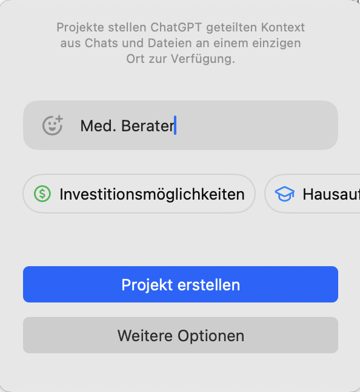
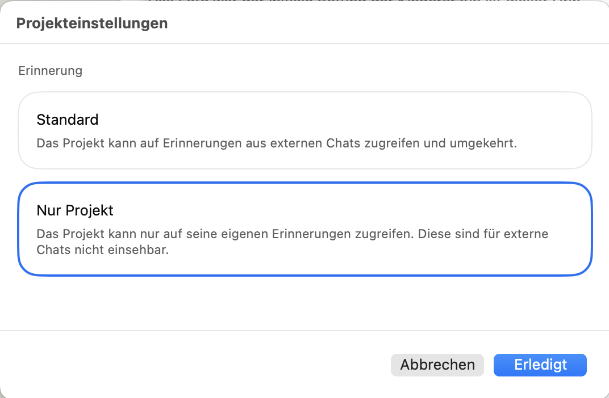
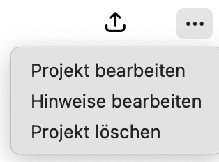
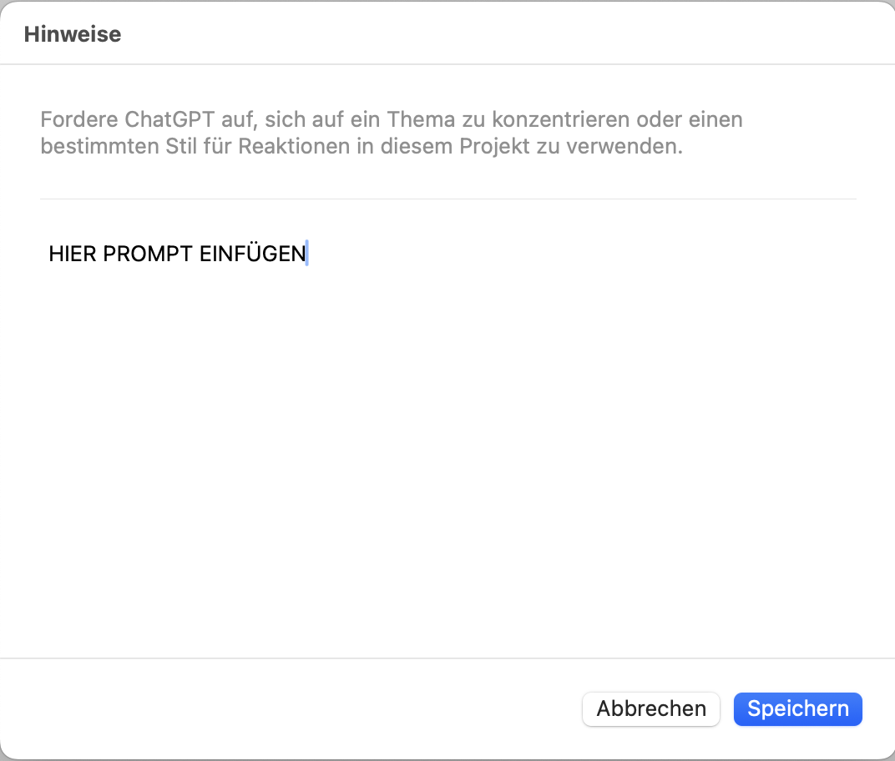
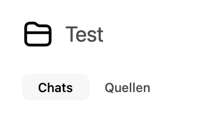

# ChatGPT-Projekt erstellen und Prompts als Hinweise hinterlegen

Diese Anleitung beschreibt, wie ein ChatGPT-Projekt für neuropädiatrische KI-Assistenz angelegt werden kann und wie die Prompt-Vorlagen aus diesem Repository als Projekt-Hinweise hinterlegt werden können.

Die Anleitung ist für ärztliche Anwender:innen gedacht. Bitte keine identifizierenden Patientendaten in ChatGPT oder andere nicht freigegebene KI-Systeme eingeben.

## Ziel

Ein ChatGPT-Projekt kann genutzt werden, um wiederkehrende Arbeitskontexte und Regeln dauerhaft zu hinterlegen. Für diese Prompt-Bibliothek ist das hilfreich, weil grundlegende Sicherheitsregeln, Quellenanforderungen und Antwortstrukturen nicht bei jedem neuen Chat vollständig neu eingegeben werden müssen.

## Voraussetzungen

- ChatGPT-Zugang mit verfügbarer Projektfunktion
- Zugriff auf dieses Repository oder lokal gespeicherte Prompt-Dateien
- vorherige Klärung, ob und wie KI-Systeme im jeweiligen klinischen Umfeld genutzt werden dürfen
- keine Eingabe personenbezogener oder re-identifizierbarer Patientendaten

## Empfohlene Grundstruktur

Für den Alltag bietet sich folgende Struktur an:

- Ein Projekt für allgemeine neuropädiatrische Assistenz
- Der Universal-Prompt als Projekt-Hinweis
- Spezialprompts als zusätzliche Dateien oder manuell kopierbare Vorlagen
- Das Standard-Eingabeformular als wiederkehrende Fallstruktur

Geeigneter Projektname:

```text
Neuropädiatrische KI-Assistenz
```

## Schritt 1: Neues ChatGPT-Projekt erstellen

1. ChatGPT öffnen.
2. In der Seitenleiste den Bereich für Projekte öffnen.
3. `Neues Projekt` auswählen.
4. Einen klaren Projektnamen vergeben, zum Beispiel `Neuropädiatrische KI-Assistenz`.
5. Projekt speichern.



Im Erstellungsdialog wird der Projektname vergeben. Über `Weitere Optionen` können zusätzliche Einstellungen gesetzt werden.



Eine sinnvolle Einstellung ist `Nur Projekt`, wenn die Projekt-Erinnerungen nicht mit anderen Chats geteilt werden sollen. Das kann helfen, medizinische Arbeitskontexte klarer zu trennen.



## Schritt 2: Projekt-Hinweise öffnen

1. Das neu erstellte Projekt öffnen.
2. Über das Drei-Punkte-Menü `Hinweise bearbeiten` auswählen.
3. Den Bereich suchen, in dem dauerhafte Anweisungen oder Hinweise für dieses Projekt hinterlegt werden können.

Je nach ChatGPT-Oberfläche kann dieser Bereich unterschiedlich benannt sein, zum Beispiel:

- `Instructions`
- `Project instructions`
- `Hinweise`
- `Projekt-Hinweise`
- `Custom instructions`



## Schritt 3: Universal-Prompt als Projekt-Hinweis hinterlegen

Als dauerhafte Projekt-Hinweise eignet sich besonders:

[Universal-Prompt für neuropädiatrische Assistenz](../Prompts/01-universal-prompt.md)

Vorgehen:

1. Datei öffnen.
2. Den Text innerhalb des `text`-Blocks kopieren.
3. In die Projekt-Hinweise von ChatGPT einfügen.
4. Speichern.



## Schritt 4: Spezialprompts ergänzen

Die übrigen Prompts können je nach Arbeitsweise auf zwei Arten genutzt werden.

### Variante A: Prompts als Dateien im Projekt hinterlegen

Falls ChatGPT im Projekt Dateien unterstützt:

1. Die gewünschten Markdown-Dateien aus dem Ordner `Prompts/` herunterladen.
2. Im Projekt hochladen.
3. In neuen Chats gezielt auf die Datei Bezug nehmen.

Beispiel:

```text
Nutze bitte den Prompt für Arztbrief-Erstellung aus den Projektdateien und erstelle aus den folgenden anonymisierten Notizen einen Entwurf.
```

Geeignete Dateien:

- [Differenzialdiagnostik](../Prompts/02-differenzialdiagnostik.md)
- [Arztbrief aus Notizen und Befunden](../Prompts/03-arztbrief-aus-notizen.md)
- [Elterninformation](../Prompts/04-elterninformation.md)
- [Administrative Tätigkeiten](../Prompts/05-administration-gutachten-antraege.md)
- [Standard-Eingabeformular](../Prompts/08-standard-eingabeformular.md)

Ein Screenshot für den Datei-Upload kann später ergänzt werden, falls diese Funktion in der verwendeten ChatGPT-Version sichtbar ist.

### Variante B: Spezialprompts bei Bedarf manuell kopieren

Wenn keine Dateien im Projekt hinterlegt werden sollen, können die Spezialprompts einfach bei Bedarf kopiert werden.

Beispiel für einen Chat:

```text
[Spezialprompt für Differenzialdiagnostik einfügen]

Fall:
[anonymisierte Falldaten einfügen]
```

Diese Variante ist besonders transparent, weil im jeweiligen Chat klar sichtbar bleibt, welcher Prompt verwendet wurde.

## Schritt 5: Quellen im Projekt nutzen

Im Projekt gibt es neben `Chats` häufig auch den Bereich `Quellen`. Dort können Dateien hinterlegt werden, die ChatGPT innerhalb dieses Projekts als Kontext nutzen kann.

Typische sinnvolle Quellen für dieses Projekt:

- die Markdown-Dateien aus dem Ordner [Prompts](../Prompts)
- eine lokale SOP oder hausinterne Vorlage, sofern die Nutzung in ChatGPT erlaubt ist
- anonymisierte Musterfälle
- eigene Formatvorlagen für Arztbriefe, Elterninformationen oder Stellungnahmen
- das [Standard-Eingabeformular](../Prompts/08-standard-eingabeformular.md)

Wichtige Einschränkung: Quellen sind Kontextmaterial, keine geprüfte Wahrheit. ChatGPT kann Inhalte aus Quellen falsch gewichten, falsch zusammenfassen oder mit Modellwissen vermischen. Medizinische Aussagen, Dosierungen, Leitlinienbezüge und Zitate müssen deshalb weiterhin geprüft werden.

Nicht als Quelle hochladen:

- echte Arztbriefe mit Patientendaten
- Befunde mit Namen, Geburtsdatum, Fallnummern oder QR-Codes
- Fotos, Videos oder Dokumente mit identifizierenden Merkmalen
- Klinikinterne Dokumente, wenn die Nutzung in ChatGPT nicht freigegeben ist
- urheberrechtlich geschützte Volltexte, wenn keine Nutzungsrechte bestehen

Empfohlene Nutzung:

1. Prompt-Dateien oder neutrale Vorlagen als Quellen hinzufügen.
2. Im Chat konkret sagen, welche Quelle genutzt werden soll.
3. Bei fachlichen Aussagen explizit um Trennung bitten zwischen:
   - Angaben aus den Projekt-Quellen
   - allgemeinem Modellwissen
   - nicht verifizierten Annahmen

Beispiel:

```text
Nutze bitte die Projektquelle zum Arztbrief-Prompt. Trenne in deiner Antwort klar zwischen Informationen aus meinen Notizen, Annahmen und offenen Punkten.
```

Ein Screenshot des Tabs `Quellen` kann später an dieser Stelle ergänzt werden.

## Schritt 6: Standard-Eingabeformular nutzen

Für klinische Fälle empfiehlt sich das Standard-Eingabeformular:

[Standard-Eingabeformular für Fälle](../Prompts/08-standard-eingabeformular.md)

Es hilft, Fälle strukturiert und ohne unnötige personenbezogene Details einzugeben.

Minimalbeispiel:

```text
Neuropädiatrischer Fall, anonymisiert:

1. Patient
- Alter:
- Geschlecht:
- Gewicht:
- relevante Vorerkrankungen:

2. Leitsymptom
- Hauptproblem:
- Beginn:
- Verlauf:

10. Meine konkrete Frage an die KI
-
```

## Schritt 7: Sicheren Workflow etablieren

Empfohlener Ablauf:

1. Fall vollständig anonymisieren.
2. Passenden Prompt auswählen.
3. KI-Antwort kritisch prüfen.
4. Quellen, Leitlinien, Dosierungen und Dringlichkeit verifizieren.
5. Ergebnis nur als Unterstützung verwenden, nicht als abschließende Entscheidung.

## Datenschutz-Hinweise

Nicht eingeben:

- Name
- Geburtsdatum
- Adresse
- Telefonnummer
- Fallnummer
- Versicherungsnummer
- exakte Behandlungsdaten bei seltenen Erkrankungen
- Fotos oder Dokumente mit identifizierenden Merkmalen
- Kombinationen aus Ort, Datum, Diagnose und seltenen Merkmalen, die eine Re-Identifikation ermöglichen könnten

Besser:

```text
6-jähriger Junge mit episodischen Bewusstseinsstörungen, Vorstellung in der Notaufnahme.
```

Nicht:

```text
Max M., geboren am 03.04.2018, aus Musterstadt, Vorstellung am 12.01.2026.
```

## Empfohlene Projekt-Hinweise in Kurzform

Falls der vollständige Universal-Prompt zu lang ist, kann folgende Kurzversion als Projekt-Hinweis genutzt werden:

```text
Du bist ein klinischer Entscheidungsunterstützungs-Assistent für Neuropädiatrie, Sozialpädiatrie und allgemeine Pädiatrie. Unterstütze ärztliche Anwender:innen bei anonymisierten Fällen, Differenzialdiagnostik, Diagnostikplanung, Arztbriefen, Elternkommunikation und administrativen Stellungnahmen.

Grundregeln:
- Du ersetzt keine ärztliche Entscheidung.
- Erfinde keine Befunde, Diagnosen, Quellen, Links, PMIDs, DOIs, Dosierungen oder Leitlinienempfehlungen.
- Markiere Unsicherheit und fehlende Informationen klar.
- Priorisiere Red Flags, gefährliche, zeitkritische und behandelbare Diagnosen.
- Frage gezielt nach, wenn wichtige Angaben fehlen.
- Gib Quellen nur an, wenn sie überprüfbar sind.
- Wörtliche Zitate nur bei tatsächlichem Zugriff auf den Quellentext.
- Keine identifizierenden Patientendaten verwenden.
```

## Noch fehlender Screenshot

Die wichtigsten Schritte sind bereits bebildert. Für eine vollständigere Version wäre noch dieser Screenshot hilfreich:

1. Projektansicht mit dem Tab `Quellen`

Screenshots bitte ohne personenbezogene Daten, Chatverläufe oder Klinik-/Patienteninformationen erstellen.

## Quelle zur ChatGPT-Projektfunktion

Die allgemeinen Schritte orientieren sich an der offiziellen OpenAI-Hilfe zu ChatGPT Projects:

- [Projects in ChatGPT - OpenAI Help Center](https://help.openai.com/en/articles/10169521-projects-in-chatgpt)
